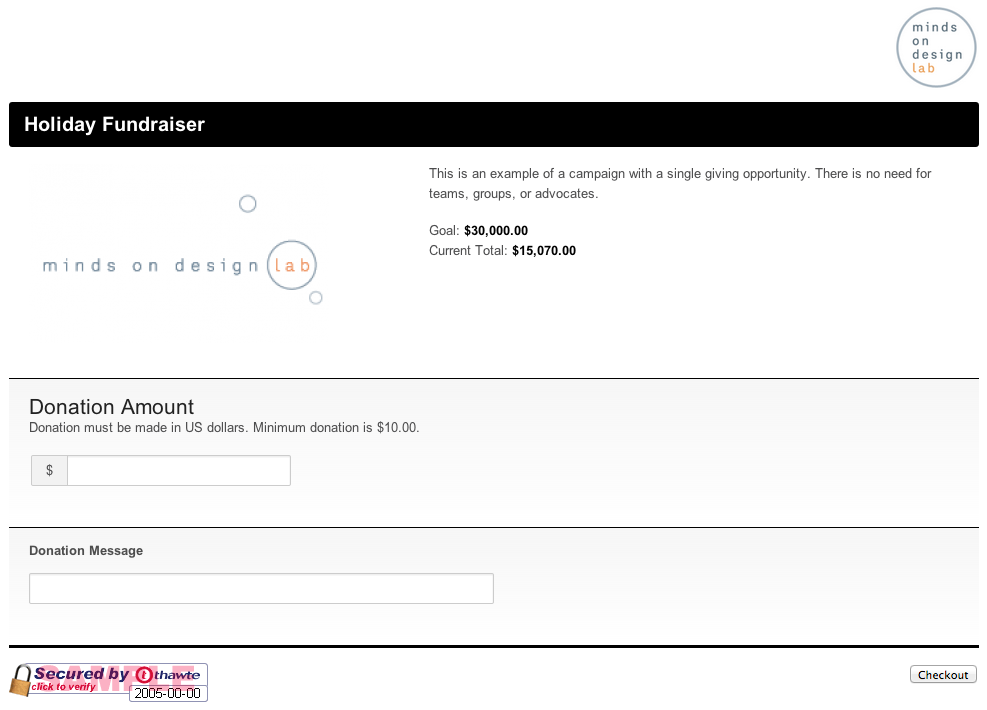

# Donation Checkout

There are two options available for setting up checkout (payment processing) experiences for donations. You can use our Hosted Checkout page or you can setup your own custom checkout page.

- [Hosted Checkout](#hosted-checkout)
- [Custom Checkout](#custom-checkout)

## Hosted Checkout

The Hosted Checkout is a secure, super quick solution that utilizes all of the Giving Impact™ campaign customization goodness. The Hosted Checkout supports donation levels, donation fields to gather data from donors, messaging content, and whatever future enhancements that may come.

Implementing a solution with Hosted Checkout is as simple as pointing donors to the `donation_url` provided in the Dashboard or via the API.

The following is an example of the first page of the Hosted Checkout.



## Custom Checkout

This approach gives you incredible flexibility to create an integrated checkout into your website/app. There are a collection of requirements to enable your checkout form as detailed below; however, how you build and integrate your form is up to you. Consistent with Stripe, there is a particular setup for credit card processing which ensure consistency of security with our hosted option and in line with Stripe's requirements that in turn greatly lessens the security compliance burden for you.

In short, this setup ensures that credit card data does not touch your server (let alone Giving Impact's) on its way to Stripe.

### How it works

**Preliminary Credit Card Processing**

1. Collect the donation and billing information.
2. Pass the credit card information to Giving Impact's checkout javascript method that coordinates with Stripe to make sure required credit card data is provided and appears valid. If it passes basic validation then Stripe provides a payment token in return.

**Donation and Full Credit Card Processing**

4. Post the donation, billing, and Stripe's payment  token to the `/donations` API method.
3. If the credit card or any Giving Impact data fails validation for any reason, the API will return an appropriate error.
4. If successful, then the donation is saved and full donation data is returned.

### Specifying the Donation Amount to be Charged

To determine the amount of the donation to be processed, you must either pass a `donation_total` or a `donation_level_id`. The following details various post cases and how they are handled.

1. **donation_total ONLY** - If you post a `donation_total` only, this is the the value that will be charged, in cents.
2. **donation_level_id ONLY** - If you post a `donation_level_id` only, first we will check that the ID matches a level for the campaign you are posting to and if so it will charge the value that is associated with that level.
3. **donation_total AND donation_level_id** - If you post both a `donation_total` and a `donation_level_id` then the `donation_total` will be the value charged; however, we will also store the level information along with the donation record.

The third case offers some interesting possibilities. Say for example you want a donor to select a level but you want to offer him/her an opportunity to donate more than the value of that level. This case allows you to post a `donation_total` that is greater than the level amount while still allowing for records to document that a specific level was chosen.

### Preliminary Credit Card Processing Requirements/Approach

- You **MUST** host your custom checkout page under SSL
- You need to include our Checkout Javascript and pass your Giving Impact Public API Key (available in Account Settings in the Dashboard).
- Form input name for your Credit Card Number, Expiration Date, and CVC number must be set to what is showcased in the example below.
- Expiration data must be in the form of MM/YYYY

This approach checks that credit card data is well formed, communicates when it is not, and creates a Stripe payment token when it is. This token is what is posted along with other required data to our API and helps to ensure that credit card data never hits your server, let alone ours. The token has all the necessary data encrypted within it for Stripe to read and process.

The code example below details the bullets above.

```html
<!-- Your form here -->
<form method="post" action="{your_target_url}">

  <!-- Your donation related fields here -->

  ...

  <!-- Required Credit Card Fields -->

  <label>Card Number:</label>
  <input type="text" name="cc_number" />

  <label>CVC:</label>
  <input type="text" name="cc_cvc" />

  <label>Expiration Date:</label>
  <input type="text" name="cc_exp" />

  <input type="submit" id="process-donation" value="Checkout" />

</form>

<!-- jQuery -->
<script src="//ajax.googleapis.com/ajax/libs/jquery/1.10.2/jquery.min.js"></script>

<!-- Load script for credit card data preparation and processing -->
<script type="text/javascript" src="http://[YOUR-GI-INSTANCE-URL-HERE]/v2/checkout?key={your_public_api_key}"></script>

<script>
  $(function() {

    $('#process-donation').click(function(e) {
      e.preventDefault();
      $(this).text('Processing...');
      $(this).attr('disabled', true);

      GIAPI.checkout({
        'card':     $('[name="cc_number"]').val(),
        'cvc':      $('[name="cc_cvc"]').val(),
        'month':    $('[name="cc_exp"]').val().substr(0,2),
        'year':     $('[name="cc_exp"]').val().substr(5,4),
      }, function(token) {
        // the card token is returned, append to form and submit
        $('#donate-form').append($('<input type="hidden" value="'+token+'" name="token" />'));
        $('#donate-form').submit();
      });
    })
  });
</script>
```

### Donation and Full Credit Card Processing

You can create a new donation by sending a POST request to the following URI.

    /donations

In addition to the authentication and user-agent headers, the following header is also required for POST requests:

    Content-Type: application/json

#### Example Post Body

```json
{
  "campaign": "1234abcde",
  "donation_date": "2013-05-16 20:00:00",
  "first_name": "Greedo",
  "last_name": "TheElder",
  "billing_address1": "100 Best Spot",
  "billing_city": "Mos Eisley Cantina",
  "billing_state": "Tatooine",
  "billing_postal_code": "10001",
  "billing_country": "United States",
  "donation_total": "5000",
  "donation_level": "",
  "contact": true,
  "email_address": "greedo@givingimpact.com",
  "card": "1234somelongtokenfromstripetostripe"
}
```

#### Arguments

The following documents the various arguments accepted.

name | requireed | type/details
------- | ----- | ------------
campaign -or- opportunity | required | string, unique identifier for the parent campaign or opportunity
donation_date | | timestamp, YYYY-MM-DD HH:MM:SS, time of donation
first_name | required | string, donor first name
last_name | required | string, donor last name
billing_address1 | required | string, billing address
billing_city | required | string, billing city
billing_state | required | string, state
billing_postal_code | required | string, billing postal code
billing_country | required | string, billing country
donation_total | conditionally required | int, donation amount, in cents
donation_level_id | conditionally required | int, this represents the unique id of the donation level
donation_level | | string, this represents the label of a donation level DEPRACATED - This field is no longer needed. Level label will be determined by the donation_level_id provided. If these data are posted, it will simply be ignored.
contact | required | boolean, true/false, default false, used to define if donor opted out of being contacted by email
email_address | required | string, email address of donor
card | required | string, Stripe Payment Token

### Implementation Notes/Tips

With great flexibility comes the need for careful and purposeful implementation. There is so much you can do with our Custom Checkout approach. You can use data and features from within the Giving Impact API for your Campaigns and Giving Opportunities or opt to go your own way, being sure to pass the required data on how you see fit.

- We would recommend checking out our code libraries in the Additional Resources area of these docs to explore some example treatments and/or speed your time to implement.
- How many of Giving Impact's features to customize the donation experience you choose to support in your checkout page is up to you.
  - Want to support an open donation input form or donation levels that can be controlled via the Dashboard? That's up to you.
  - Want to support custom donation fields? Again, that's up to you.
- One of the exciting possibilities of a Custom Checkout that cannot be done with the hosted solution is the ability to weave it into a flow of actions seamlessly.
  - Say for example you want to collect a donation before allowing someone to create an e-card.
  - If you have a user capability on your website where folks are registered, you could pre-populate the contact/billing info of the form to streamline the checkout experience even further.
  - Want to have your donation levels be presented as images instead of simple text ... go for it. You can make that happen on your end and simply pass the required donation total amount to the form.
- This is technology that allows you to be creative.
